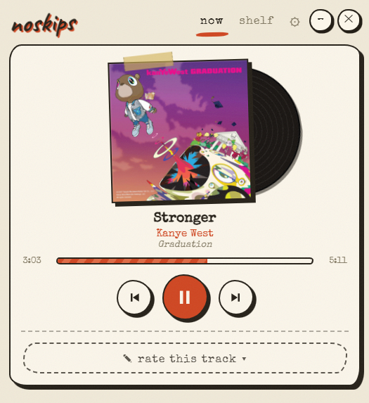
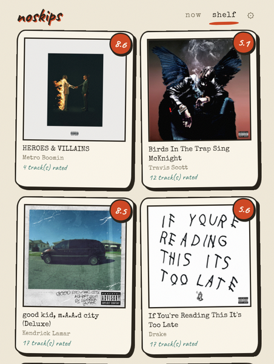

# noskips ♪

*judge every song. keep receipts.*

A tiny Windows widget that shows what Spotify is playing and lets you stamp a
verdict on every song — typewriter, handwriting, washi tape and all.

<p align="center">
  
  
</p>

> Previously released as **Rateify** — renamed in 2.0.0 because that name was
> already taken. Your library comes across automatically the first time you run
> it; see [docs/RELEASING.md](docs/RELEASING.md).

## Why it's neat

- **A real desktop widget** — frameless, always-on-top native window
  (WebView2). Drag it around by the wordmark, park it in a corner, ✕ when done.
- **No Spotify API keys, no OAuth, no account.** It reads the Windows media
  session (SMTC), so it just works with the Spotify desktop app — or anything
  else that plays media.
- **Media buttons** — previous / play-pause / next, with a vinyl that slides
  out and spins while music plays.
- **An opinionated rating scale** — `light 1 → 1 → strong 1 → … → strong 9 →
  light 10 → 10` (light = −⅓, strong = +⅓ when averaging). Because sometimes
  a 7 is *barely* a 7.
- **Notes** — scribble why, saved with the rating.
- **The shelf** — everything grouped by album with the real cover art and the
  album average (plain mean of its rated tracks).
- **Honest storage** — one human-readable `data/ratings.json`, covers cached
  as plain images in `covers/`. Grep it, back it up, take it with you. Set
  `NOSKIPS_DATA_DIR` if you'd rather keep the library somewhere else.
- **Songs and videos, filed separately** — Windows says whether what's playing
  is music or a video, so a YouTube clip gets rated exactly like a song but
  lands in `data/videos.json` and its own shelf. Videos never leave your
  machine: the sync engine is only ever handed the music store.
- **Speaks your language** — English, Türkçe, Español, 日本語, 中文, switchable
  from the gear icon.
- **Color themes** — classic, noir, mint, berry, ocean — same hand-stamped
  look, different palette.
- **A mini, almost-hidden mode** — tuck it away into a tiny transparent bar,
  in one of four looks: **the spool** (a mini cassette whose tape winds as the
  song plays), **the groove** (a tiny record with the tonearm tracking inward),
  **the hiss** (sixteen bands of what's actually coming out of your speakers),
  or **the ticker** (the title typed onto receipt paper feeding out).
- **The trace** — switch listening on and every stamp keeps the shape of the
  sound at the second you made it, drawn onto the verdict here and on the web.
  Only ever recorded when the track was genuinely playing: a trace claims *this
  is what it sounded like*, so an invented one would make the honest ones
  worthless.

## The social half

Optional, off, and silent until you ask for it. Sign in and your shelf gets a
page with your name on it.

- **Nothing leaves your machine until you sign in and switch sync on** — not
  even the lookup that asks what other people thought, because asking tells the
  server what you're playing. Covers never leave at all, and neither do videos.
- **Offline-first.** Rating writes to your local JSON and queues; the network
  happens later, on its own thread. The button never waits.
- **First press** — if nobody in the world has ever rated the track you're on,
  the widget says so and the credit is yours. A song has no page here until a
  human stamps it: no scraped catalog, no empty pages with a zero in them.
- **The web** — profiles, album pages with the whole 1–10 scale as a histogram,
  a chronological feed of people you follow, and cosigns instead of likes.
- Sign in with Google, Discord or email. The exe never holds a secret: it hands
  the login to your real browser and waits for a token it can use.

See [docs/SERVER.md](docs/SERVER.md) to run the server, and
[docs/WEBSITE.md](docs/WEBSITE.md) for the marketing site (planned, not built).

## Install

Grab the latest [release](../../releases):

- **`noskips-Setup-x.y.z.exe`** — per-user installer, no admin needed, adds a
  start-menu (and optionally desktop) shortcut.
- **`noskips-x.y.z-portable.zip`** — unzip anywhere and run `noskips.exe`.

Your library lives in `data/` next to the exe and survives updates and
uninstalls. If WebView2 is somehow missing, it falls back to opening the UI
in your browser.

## Run from source

```
pip install -r requirements.txt
python app.py
```

Opens `http://127.0.0.1:7700`. Requires Windows 10/11 and Python 3.10+.

To build the exe / installer yourself, see [docs/RELEASING.md](docs/RELEASING.md).

## Fonts

[Special Elite](https://fonts.google.com/specimen/Special+Elite) (Apache 2.0)
and [Caveat](https://fonts.google.com/specimen/Caveat) (OFL), bundled in
`static/fonts/`.

## License

[MIT](LICENSE) — hand-built · open source · yours.
